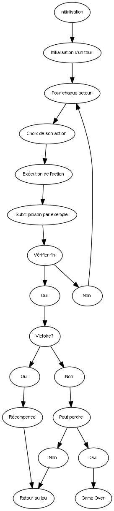

L'intégralité de ce document peut être amené à être modifié !

# Système de combat : boite noire
L'idée générale du projet est de proposer, sous forme de commandes, une 
manière propre de manipuler son propre système de combat au travers d'une 
machine à état finis.

## Flot général d'un système
Il est évident qu'il ne faut pas considérer l'automate comme bloquant (ça 
rendrait la construction de A-RPG impossible), cependant, l'implémentation
des commandes respectant ce flôt me semble tout à fait viable sur le 
long terme:

Cette représentation est **fortemment* schématique (et probablement peu 
exhaustive). Il s'agira de tâcher de la compléter lors de l'implémentation
concrète du système (*voir*: [flot.dot](flot.dot)). \
Par exemple, la fuite a été oubliée dans ce flot.

### Modelisation des étapes
Dans le schéma précédent, une grande partie des étapes à été mise en 
lumière. Un combat est déclenché contre un groupe, s'en suit une 
boucle sur les actions à effectuer pour le combat.\
Il ne s'agit pas de créer une scène reprenant chacune de ces étapes, mais 
d'offrir des commandes permettant à l'utilisateur de choisir ponctuellement
l'étape dans laquelle il se trouve. Une bonne approche serait donc 
d'utiliser une commande renvoyant correctemment l'étape en cours.

## Interactions utilisateurs
De la même manière que via les commandes *in_battle*, il faut être 
capable de renvoyer correctement les données des opposants et des acteurs.
De plus, il faut automatiser le calcul des dégats en cas de "demande". 
Une notion d'état est donc primordiale. 

## Prérequis 

*   Commande d'initialisation de combat 
*   Commande d'état du combat (fini ou non)
*   Commandes de récupération d'informations sur le combat en cours :
    *    Stats et States d'un acteur quelconque
    *    Données visuelles d'un acteur quelconque
    *    Mort potentielle
    *    Objets/exp laissés (pour les monstres)
    *    Eventuellement un état général
         (Pour faciliter la conception de combat scénarisés)
*   Commandes d'étape du combat (qui <> quoi)
*   Commandes d'information sur le combat (peut le perdre par exemple)
*   Corélation avec le toolkit ([Voir](#Toolkit))
*   Commandes de renvoi d'action en cours
*   Commandes d'exécution d'action

Ce survol générale et à compléter doit être pensé de manière à ce que 
les commandes renvoient des informations pertinentes. Par exemple, 
imaginons `perform_enemy_action(id)` pourrait renvoyer l'ID de l'acteur 
sur laquel il a agit et l'action renvoyée. Il faut donc saisir des 
commandes intermédiaires pour caractériser correctement toutes les actions
effectuées ! 

## Toolkit
En plus de proposer une collection de commandes abstraites pour la 
réalisation concrète du combat, il est important d'offrir des objets 
facilement utilisables. Par exemple, une boite (basée sur les fenêtres 
de Raho) pour les skills, objets pertinement implémentées.

## Apparence générale du code
Une fusion entre BattleManager, Game_Troop et Scene_Battle. A discuter

## Commandes à implémenter
A compléter

-  [ ]  `start_custom_battle(troop, can_lose, can_escape)`
-  [ ]  `battle_is_finished?`